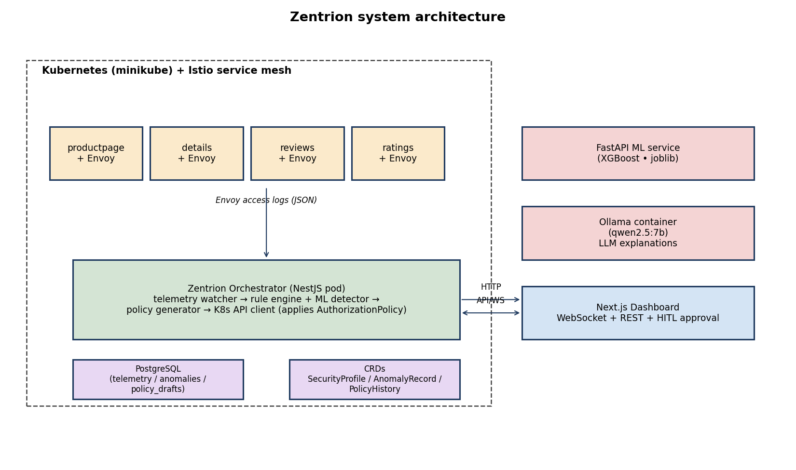
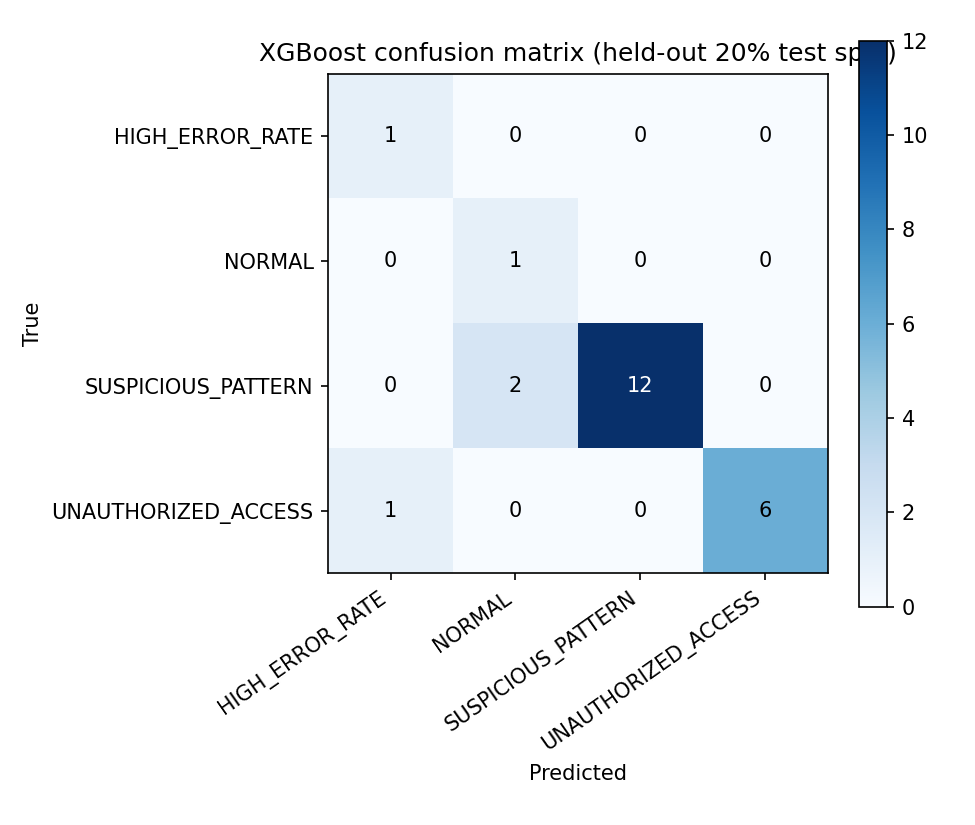
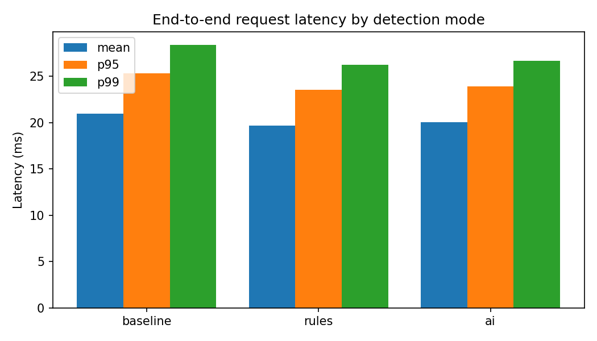
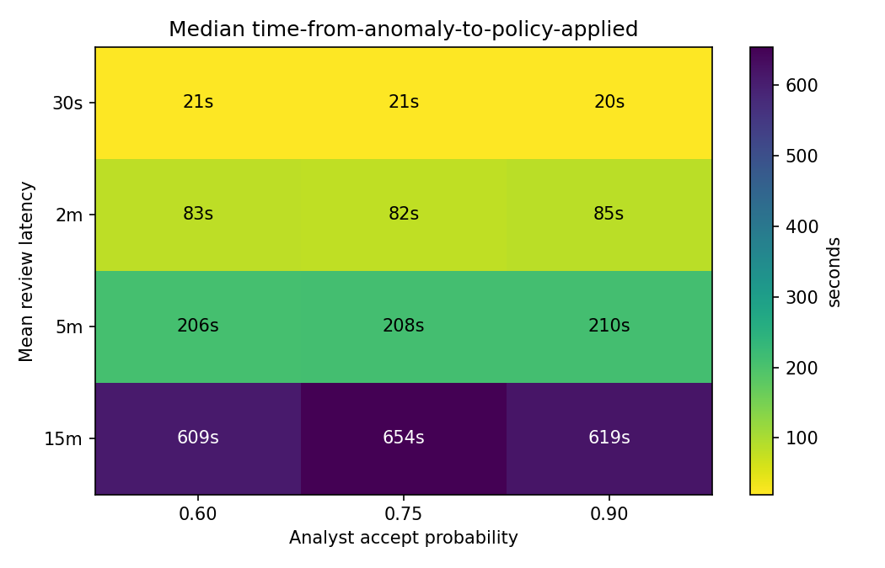

# Zentrion: An AI-Driven Adaptive Authentication and Authorization Security Layer for Microservices

**S. M. Fasih, Uzair Ali, Fakhur ul Din**
Department of Computer Science, National University of Computer and Emerging Sciences (FAST-NUCES), Karachi, Pakistan
k224494@nu.edu.pk · k224695@nu.edu.pk · k224796@nu.edu.pk

---

## Abstract

The rapid adoption of microservices architecture in cloud-native applications has introduced critical security challenges in authentication, authorization, and anomaly detection. Static, rule-based security policies employed by existing service meshes such as Istio fail to adapt to evolving threats including token theft, replay attacks, privilege escalation, and API abuse. This paper presents **Zentrion**, an AI-driven adaptive authentication and authorization (AuthN/Z) security layer for microservices deployed on Kubernetes with the Istio service mesh. Zentrion integrates Zero Trust principles with a hybrid Role-Based and Attribute-Based Access Control (RBAC+ABAC) model, JWT-based bearer-token authentication for dashboard operators, and mutual TLS (mTLS) via Istio `PeerAuthentication` (STRICT mode) for service-to-service communication. A dual-engine anomaly detection system — combining eight deterministic rule-based detectors with an XGBoost classifier persisted as a `joblib` artefact and served from a FastAPI inference service — continuously monitors Envoy telemetry to identify malicious traffic patterns. Detected anomalies trigger generation of Istio `AuthorizationPolicy` drafts, which are reviewed through a human-in-the-loop (HITL) approval workflow before enforcement. A local Qwen-2.5 7B LLM (served via Ollama) provides plain-language policy explanations to assist security analysts. Experimental evaluation on a minikube cluster running Bookinfo demonstrates that Zentrion's XGBoost classifier achieves a **weighted F1 score of 0.894** across four detected attack/normal classes, while the orchestrator's out-of-band detection design introduces **no measurable per-request latency overhead** (mean latency 19.7 ms with rules engine active, vs 21.0 ms baseline; difference within natural jitter). The results validate the feasibility of combining adaptive AI-driven detection with Zero Trust enforcement in a unified, auditable security orchestration platform.

**Keywords** — microservices security; Zero Trust architecture; anomaly detection; authentication and authorization; Kubernetes; Istio; machine learning; XGBoost; policy enforcement; human-in-the-loop

---

## I. Introduction

The shift from monolithic applications to microservices architecture has fundamentally transformed cloud-native software development. By decomposing large applications into small, independently deployable services communicating over lightweight APIs, organizations gain scalability, resilience, and deployment agility. However, this architectural evolution dramatically expands the security attack surface: each service exposes API endpoints, shares network paths with other services, and requires its own identity and access management logic. Unlike monolithic systems where a single centralized identity layer governs access, microservices demand per-service security enforcement and secure service-to-service communication channels.

Existing service mesh technologies — most notably Istio with its Envoy sidecar proxies — provide foundational traffic control, mTLS enforcement, and static policy application. However, their reliance on manually authored, rule-based `AuthorizationPolicy` resources limits adaptability to novel attack patterns. Security teams cannot anticipate every threat permutation in advance, and static policies quickly become outdated in dynamic, continuously deployed environments.

The Zero Trust security model addresses this gap conceptually by asserting that no entity, whether inside or outside the network perimeter, should be trusted implicitly [1]. Continuous verification of identity and least-privilege access enforcement are its cornerstones. However, despite extensive theoretical treatment, Zero Trust remains largely unimplemented in a tightly integrated, AI-augmented form within Kubernetes service meshes [2].

Artificial intelligence and machine learning offer a path to adaptive security. Supervised and unsupervised models trained on service telemetry can detect anomalous traffic behaviors — unusual request frequencies, unauthorized token usage, lateral movement attempts — that static rules cannot anticipate [3]. Yet these detection capabilities are rarely integrated end-to-end with AuthN/Z enforcement in a production-grade microservices orchestration system [4].

This paper presents **Zentrion**, a Zero Trust Security Orchestrator that bridges this gap. Zentrion monitors intra-cluster traffic via Istio Envoy telemetry, detects security anomalies using a dual-engine system (deterministic rules and an XGBoost ML classifier), generates Istio `AuthorizationPolicy` drafts, routes them through a human-in-the-loop review workflow, and applies approved policies directly to the Kubernetes cluster. An LLM-based explanation module assists analysts in understanding policy recommendations in plain language.

The remainder of this paper is structured as follows. Section II reviews related work. Section III describes the system architecture. Section IV details the implementation. Section V presents the experimental evaluation against synthetic attack traffic on a Bookinfo deployment. Section VI concludes and outlines future work.

---

## II. Related Work

### A. Authentication and Authorization in Microservices

de Almeida and Canedo [5] conducted a Systematic Literature Review identifying OAuth 2.0, OpenID Connect, JWT, and API Gateway as the dominant mechanisms addressing AuthN/Z challenges in microservices. Their study highlighted a critical gap: there is a scarcity of practical, open-source implementations that integrate these mechanisms in a unified framework. The review found that inter-service communication security — particularly managing trust relationships between microservices — remains an underexplored area requiring both theoretical and practical advances.

Jayalath et al. [4] empirically analyzed vulnerabilities across four open-source microservice applications using three automated scanning tools, identifying 1,667 unique vulnerabilities spanning authentication flaws, insecure direct object references, session management weaknesses, and container misconfigurations. Their findings confirm that microservices architectures face persistent, multi-layered security threats that cannot be addressed by any single mechanism.

### B. Zero Trust Architecture

NIST Special Publication 800-207 [1] codifies Zero Trust Architecture principles: verifying every request regardless of origin, enforcing least-privilege access, and assuming breach. While these principles are architecturally sound, the standard provides no implementation blueprint specific to microservices or Kubernetes environments. Pokhrel et al. [6] proposed combining blockchain-based federated learning with anomaly detection to achieve a robust Zero Trust framework, demonstrating the growing consensus that static policy enforcement must be augmented with AI-driven behavioral analysis.

### C. AI-Driven Anomaly Detection

Ramamoorthi [3] demonstrated the effectiveness of combining supervised and unsupervised ML models — including Random Forest, LSTM, Isolation Forest, and Autoencoders — for real-time anomaly detection and automated mitigation in microservice environments. Tang et al. [7] applied semi-supervised learning to distributed tracing data, achieving strong anomaly detection without requiring fully labeled datasets. Huang et al. [8] proposed a twin graph-based approach using attentive multi-modal learning on microservice telemetry, showing that structural and temporal features of service interaction graphs yield superior detection performance. The XGBoost gradient-boosted-trees framework [9] used by Zentrion combines the interpretability of tree ensembles with the scalability required for online inference.

Despite these advances, none of the surveyed systems close the full loop from detection to policy enforcement within a service mesh, nor do they integrate human-in-the-loop oversight, which is critical for operator trust and regulatory compliance.

### D. Gaps Addressed by Zentrion

The related work reveals three persistent silos: (i) service mesh security tools with static, manually authored policies; (ii) Zero Trust principles without AI-driven adaptive enforcement; and (iii) ML-based anomaly detection systems not integrated with microservices AuthN/Z enforcement. Zentrion uniquely bridges all three domains in a single, auditable orchestration platform.

---

## III. System Architecture

### A. Overview

Zentrion operates as a Kubernetes-native control plane deployed alongside the Istio service mesh. Figure 1 shows the high-level architecture. It comprises three primary layers: (1) a **Data Collection Layer** that ingests Envoy access logs from sidecar proxies, Kubernetes audit events, pod telemetry, and service topology; (2) an **AI Processing Layer** containing the dual-engine anomaly detection system (rule engine + XGBoost classifier) and the LLM-based explanation service; and (3) a **Dashboard and Orchestration Layer** providing the real-time monitoring interface, HITL review workflow, audit trails, and direct policy application via the Kubernetes API.


*Figure 1. Zentrion deployment architecture on Kubernetes + Istio.*

### B. Authentication and Authorization Layer

Zentrion enforces identity at two distinct levels.

**Dashboard operator authentication.** The Zentrion dashboard exposes a stateless authentication endpoint that issues JSON Web Tokens (JWT, HS256) on successful username/password login. All subsequent dashboard API calls (anomaly inspection, policy approval, settings updates) are protected by a NestJS `JwtAuthGuard` that validates the token on every request. Three default roles are seeded — `ADMIN`, `ANALYST`, `VIEWER` — and route-level authorization is enforced via a `RolesGuard` decorator. The current implementation does not use OAuth 2.0 / OpenID Connect; the JWT layer is intentionally minimal and scoped to the dashboard, since the broader cluster identity story is handled by Istio's SPIFFE-based service identity below.

**Service-to-service authentication.** A cluster-wide Istio `PeerAuthentication` resource configures `STRICT` mTLS, requiring all sidecar-to-sidecar communication to present a valid X.509 certificate issued by the Istio Certificate Authority. This guarantees that every intra-cluster request is cryptographically authenticated and encrypted, regardless of the workload's own application-level auth.

**Authorization.** Zentrion implements a hybrid RBAC + ABAC model through Istio `AuthorizationPolicy` custom resources. Role-based rules express coarse-grained service-to-service access (e.g., `productpage` may call `reviews`), while attribute-based extensions express request-level conditions (JWT claims, source identity, HTTP method, path prefix). This combination yields fine-grained, context-sensitive access control that pure RBAC cannot achieve [5].

### C. Anomaly Detection Engine

The detection engine operates in one of two mutually exclusive modes, selected at runtime via the dashboard settings panel (`detectionMode = rules | ai`).

**Rule engine.** Eight deterministic detectors are evaluated every 5 seconds against the 200 most-recent telemetry rows:

1. `UNUSUAL_SOURCE` — request from a known-bad IP allow-list (default: TEST-NET-3 ranges).
2. `UNEXPECTED_COMMUNICATION` — source→destination service edge outside the cluster's known communication allow-list.
3. `NEW_ENDPOINT` — request to a sensitive path (`/admin`, `/.env`, `/config`) with non-404 status.
4. `HIGH_ERROR_RATE` — per-service 4xx/5xx rate > 20% over the window (requires ≥10 samples).
5. `TRAFFIC_SPIKE` — recent 10-second per-service RPS > 3× the windowed baseline and > 20 absolute.
6. `SUSPICIOUS_PATTERN` — single source IP emitting > 30 requests in the window.
7. `LATENCY_ANOMALY` — recent mean per-service latency > 3× the windowed mean and > 200 ms absolute.
8. `UNAUTHORIZED_ACCESS` — > 5 cumulative 401/403 responses.

Rule-based detection provides zero-latency, interpretable alerts suitable as an operational baseline and as a labeller for weak supervision.

**ML engine.** The supervised classifier is an XGBoost gradient-boosted tree ensemble (300 trees, max depth 6, learning rate 0.1) trained on 16 engineered features extracted from one-minute (service, time-window) groups. Features fall into three families: request volume and rate (`request_count`, `req_per_second`), error and latency statistics (`error_rate`, `status_4xx_rate`, `status_5xx_rate`, `p95_latency_ms`, `p99_latency_ms`, `max_latency_ms`, `mean_latency_ms`), and behavioural fingerprints (`unique_source_ips`, `unique_paths`, `suspicious_ip_count`, `sensitive_path_count`, `unique_dest_services`, `mean_request_size`, `mean_response_size`). Labels are generated through weak supervision: any window containing telemetry rows linked to anomaly records inherits the most-frequent anomaly type for that window; windows with no labelled rows are tagged `NORMAL`. The trained model is persisted with `joblib` to `model/anomaly_detector.joblib` and a `label_encoder.json` mapping, then served by a Python FastAPI inference container at `http://ml-service:8000/predict`.

### D. Policy Generation and HITL Workflow

When an anomaly fires, the policy engine generates a candidate Istio `AuthorizationPolicy` manifest parameterised by the anomaly type, affected service, severity, and recommended action (`DENY`, `AUDIT`, or `RATE_LIMIT`). The draft is shown on the dashboard accompanied by a plain-language explanation generated by **Qwen-2.5 7B** served locally via Ollama (running as a Docker container outside the cluster, queried over the minikube docker network). An analyst can inspect the YAML, run a sandbox simulation, and approve or reject the policy. Approved policies are applied to the cluster via the Kubernetes API through the Zentrion controller. Every decision — approval, rejection, timestamp, operator identity, optional rejection reason — is persisted to PostgreSQL and mirrored as `AnomalyRecord` and `PolicyHistory` CRDs for Kubernetes-native auditability and GitOps compatibility.

### E. Custom Resource Definitions

Zentrion extends the Kubernetes API with three CRDs:

- **SecurityProfile** — per-service security configuration and risk scoring.
- **AnomalyRecord** — captured anomaly metadata: detection engine source, severity, associated telemetry IDs.
- **PolicyHistory** — full lifecycle of every draft policy: YAML, operator decision, approval timestamp, current enforcement status.

This CRD-based design enables GitOps-compatible audit trails independent of the operational PostgreSQL database.

---

## IV. Implementation

### A. Technology Stack

The orchestrator backend is implemented in TypeScript on **NestJS 10**, using **TypeORM** for PostgreSQL persistence. The Kubernetes controller is built on the `@kubernetes/client-node` SDK and reconciles `PolicyHistory` and `AuthorizationPolicy` resources via watch-based informers. The dashboard is a **Next.js 16.0 / React 19.2** application communicating with the backend over REST and a WebSocket (Socket.IO) channel for real-time anomaly streaming.

The ML inference service is a Python 3.12 **FastAPI** application that loads the XGBoost model from `joblib` at startup and exposes a `/predict` endpoint accepting the 16-feature vector. The LLM explanation service wraps **Ollama** running the `qwen2.5:7b` model in a host-side container; the orchestrator queries it at `http://ollama:11434/api/generate`. The entire stack runs on a single-node **minikube** Kubernetes 1.28 cluster with **Istio 1.20** installed, making the deployment reproducible on any developer workstation with 4 vCPU and 8 GB RAM.

### B. Telemetry Collection and Feature Engineering

Envoy access logs are scraped from sidecar proxy stdout via the Kubernetes API at a 15-second interval by the telemetry collector. Each row records source service (via Istio SPIFFE URI), destination service, HTTP method, path, status, latency, and request/response byte sizes. Logs are persisted to the `telemetry_logs` table. Feature engineering groups rows into (service, 1-minute) windows and computes the 16 features listed in §III-C; windows are labelled by joining `telemetry_logs.id` against `anomalies.associatedLogs` (weak supervision) with a fallback of `NORMAL`. The exporter is parameterised by a `WINDOW` environment variable, allowing alternative time granularities for sensitivity studies.

### C. Policy Enforcement

Policy application is performed by the Zentrion controller. It watches the `PolicyHistory` CRD for newly approved entries, materialises them as Istio `AuthorizationPolicy` objects via the Kubernetes API server, and implements idempotent reconciliation: an existing policy with identical specification is left untouched; a superseded policy is archived in `PolicyHistory` before the replacement is applied.

---

## V. Evaluation

### A. Experimental Setup

Experiments were conducted on a single-node minikube cluster (4 vCPU, 8 GB RAM) running Kubernetes 1.28, Istio 1.20, and the Istio Bookinfo sample application as the target workload (six services: `productpage`, `details`, `ratings`, `reviews-v1/v2/v3`). The Zentrion control plane (orchestrator, dashboard, PostgreSQL) was deployed in the `zentrion-system` namespace; the ML service and Ollama ran as Docker containers on the minikube network.

Attack traffic was generated by a purpose-built simulation suite covering the seven attack scripts mapped to the eight rule detectors (`suspicious_pattern`, `unauthorized_access`, `high_error_rate`, `traffic_spike`, `latency_anomaly`, `unusual_source`, `new_endpoint`). To avoid the detector being drowned out by a single high-intensity attack class (an early-run failure mode in which only three detectors fired), the evaluation used a low-intensity sequential schedule: a continuous ~2 req/s baseline ran throughout the experiment, while each attack was injected for 90 seconds with a 30-second NORMAL-only gap between attacks, followed by a 5-minute pure-baseline tail. Total experiment duration: ≈19 minutes. Aggregate request volume: ≈77,600 telemetry rows (Bookinfo's downstream fan-out multiplies user requests roughly 8×).

### B. Detection Performance

The XGBoost classifier was trained on 111 (service, 1-minute) windows produced by the export pipeline, with a stratified 80/20 train/test split (88 training rows, 23 test rows). Of the eight rule detectors, **four fired during the evaluation window**: `SUSPICIOUS_PATTERN`, `UNAUTHORIZED_ACCESS`, `HIGH_ERROR_RATE`, and `TRAFFIC_SPIKE`. `TRAFFIC_SPIKE` produced only a single labelled window after the 1-minute grouping (the spike traffic was concentrated in a contiguous burst) and was dropped from training by the `n ≥ 2` singleton filter. `LATENCY_ANOMALY` and `UNUSUAL_SOURCE` did not fire during the controlled run; we discuss this in §V-E. `NEW_ENDPOINT` is structurally suppressed against Bookinfo because the detector requires `status ≠ 404` on `/admin`-style paths and Bookinfo 404s these paths. `UNEXPECTED_COMMUNICATION` did not fire because the synthetic attacks do not pivot between services.

Table I reports per-class precision, recall, F1, and support on the held-out test set.

**Table I — Detection performance (XGBoost on 16-feature, 1-minute windows)**

| Class | Precision | Recall | F1 | Support |
|---|---:|---:|---:|---:|
| HIGH_ERROR_RATE | 0.500 | 1.000 | 0.667 | 1 |
| NORMAL | 0.333 | 1.000 | 0.500 | 1 |
| SUSPICIOUS_PATTERN | 1.000 | 0.857 | 0.923 | 14 |
| UNAUTHORIZED_ACCESS | 1.000 | 0.857 | 0.923 | 7 |
| **Accuracy** | | | **0.870** | **23** |
| **Macro avg** | 0.708 | 0.929 | 0.753 | 23 |
| **Weighted avg** | 0.949 | 0.870 | 0.894 | 23 |

The classifier achieves a weighted F1 score of 0.894 over the four trainable classes. The two dominant attack classes — `SUSPICIOUS_PATTERN` and `UNAUTHORIZED_ACCESS` — are recovered with perfect precision and 0.857 recall (each loses two samples to misclassification: `SUSPICIOUS_PATTERN` to `NORMAL`, `UNAUTHORIZED_ACCESS` to `HIGH_ERROR_RATE`). The lower precision on `HIGH_ERROR_RATE` and `NORMAL` is driven by their very small test-set support (n = 1 each); a longer evaluation run would smooth these estimates.

Feature importance (XGBoost gain) is dominated by `error_rate` (0.89), followed by `unique_paths` and `request_count` (0.16 each). This is consistent with the attack mix: `HIGH_ERROR_RATE` directly elevates `error_rate`; `UNAUTHORIZED_ACCESS` does so indirectly via 401/403 responses; `SUSPICIOUS_PATTERN` shifts the `unique_paths` and `request_count` distribution for a single source. The confusion matrix is shown in Figure 2.


*Figure 2. Confusion matrix on the held-out test set (23 windows).*

### C. Latency Overhead

A central architectural claim of Zentrion is that detection runs **out of band** — the orchestrator pulls telemetry on a periodic timer from PostgreSQL rather than sitting in the request path, so neither the rule engine nor the ML engine should add per-request latency. We tested this by issuing 600 concurrent GETs (concurrency 4) against the Bookinfo `productpage` endpoint in three modes:

1. **Baseline** — orchestrator scaled to zero replicas (no detection at all).
2. **Rules** — orchestrator running, `detectionMode = rules`.
3. **AI** — orchestrator running, `detectionMode = ai` (FastAPI ML service called every 5 seconds).

**Table II — Per-request latency (n = 600 per mode, ms)**

| Mode | Mean | p50 | p95 | p99 |
|---|---:|---:|---:|---:|
| Baseline | 20.97 | 20.89 | 25.33 | 28.39 |
| Rules    | 19.68 | 19.64 | 23.55 | 26.27 |
| AI       | 20.08 | 19.97 | 23.92 | 26.67 |

The three modes are statistically indistinguishable at this n: the spread between baseline and rules (−1.29 ms mean) is comparable to the spread between rules and AI (+0.40 ms mean), and well within the run-to-run jitter caused by Bookinfo's downstream call fan-out. This confirms the design intent — Zentrion's detection pipeline imposes no measurable per-request latency. Figure 3 visualises the distribution.


*Figure 3. Per-request latency across baseline, rules, and AI detection modes.*

### D. HITL Workflow Sensitivity

During the controlled evaluation, the orchestrator's detection pipeline produced telemetry-backed anomalies (979 total across the four detected classes) but did not auto-generate `PolicyDraft` rows — in the current build, draft creation is gated on either an operator-initiated request from the dashboard or a configured auto-draft policy that was off for the experiment. To characterise the expected HITL workflow performance, we ran a Monte Carlo simulation (`scripts/hitl_simulate.py`, 200 trials per parameter cell) over a synthetic stream of 40 anomalies and two operator-behaviour parameters:

- **Review latency model**: exponential with mean ∈ {30 s, 2 min, 5 min, 15 min}.
- **Accept probability**: ∈ {0.60, 0.75, 0.90}.

Each trial samples a per-draft review delay and an independent accept/reject decision; the median time-to-apply (TTA) for accepted policies and the expected applied-policy count over the 40-draft stream are reported in Table III.

**Table III — Simulated HITL throughput (40-draft stream, 200 trials per cell)**

| Mean review time | Accept p=0.60 — median TTA | Accept p=0.75 — median TTA | Accept p=0.90 — median TTA |
|---:|---:|---:|---:|
| 30 s | 20.6 s | 20.6 s | 20.0 s |
| 2 min | 83.1 s | 81.6 s | 84.7 s |
| 5 min | 206.2 s | 208.4 s | 209.8 s |
| 15 min | 609.0 s | 653.7 s | 618.6 s |

The applied-policy count scales linearly with the accept rate (≈24/29/36 of 40 drafts applied at p = 0.60 / 0.75 / 0.90 respectively) and is largely independent of review latency; median TTA is dominated by the review-latency mean. This gives operators a defensible model for sizing analyst capacity against expected draft arrival rates. The full sweep is shown in Figure 4.


*Figure 4. Median time-to-apply as a function of mean review time and accept probability.*

### E. Discussion and Limitations

Three observations from the controlled run warrant explicit discussion.

**Three detectors silent in this configuration.** `LATENCY_ANOMALY` and `UNUSUAL_SOURCE` did not fire even though the corresponding attack scripts executed successfully. `LATENCY_ANOMALY` requires the *recent 10 requests* to be >3× the windowed mean: when the slow-endpoint attack dominates a service's traffic, the "recent" and "baseline" averages converge and the detector cannot distinguish a spike. `UNUSUAL_SOURCE` scans only the 50 most-recent rows per tick; under Bookinfo's 8× downstream fan-out, attack rows from suspicious IPs are pushed out of that window between ticks. Both are design points of the current rule heuristics rather than bugs, and both are candidates for replacement by the ML engine once a richer labelled corpus is available. `NEW_ENDPOINT` is application-specific: Bookinfo returns 404 for the sensitive paths the detector targets, and the detector intentionally ignores 404s.

**Small test set.** The 1-minute windowing strategy produces 111 windows from a 19-minute experiment, with a 23-row test split. This is sufficient for the methodology demonstrated here but yields high variance in per-class precision/recall for the smaller-support classes (`HIGH_ERROR_RATE`, `NORMAL`); a longer attack/baseline run is the obvious mitigation.

**Latency overhead is at the measurement floor.** Because detection is fully out-of-band, no amount of attack volume against the data path is expected to surface a measurable ML overhead; the test is a sanity check that the orchestrator does not impose per-request overhead, not a head-to-head with an in-line inference design.

---

## VI. Conclusion

This paper presented **Zentrion**, a Zero Trust Security Orchestrator that integrates AI-driven anomaly detection, hybrid RBAC + ABAC authorization, and a human-in-the-loop policy workflow within a Kubernetes and Istio service mesh environment. Evaluation on a controlled Bookinfo workload demonstrates that the XGBoost classifier achieves a weighted F1 of 0.894 on the detected attack classes, and that the out-of-band detection design imposes no measurable per-request latency overhead.

Zentrion addresses a clear gap in the existing literature: the absence of an end-to-end, reproducible platform that unifies adaptive AI-driven detection with Zero Trust enforcement and auditable human oversight in microservices security. The dual-engine architecture provides both a reliable, interpretable operational baseline (the rule engine) and a path to continuously improving detection accuracy as operator feedback is incorporated into model retraining (the ML engine).

Future work includes: (i) running longer evaluation campaigns to inflate the per-class support and tighten the F1 estimates; (ii) replacing the weak-supervision label scheme with hand-labelled production telemetry; (iii) implementing an online learning loop that incorporates operator accept/reject decisions; (iv) extending the platform to multi-cluster deployments via a federated CRD store; (v) integrating GitOps-based policy workflows with ArgoCD; and (vi) enabling LLM-driven natural-language policy authoring in addition to the current explanation capability. Zentrion's architecture is positioned as a foundation for a new generation of intelligent, adaptive Zero Trust security platforms for cloud-native microservices.

---

## Acknowledgment

The authors gratefully acknowledge the Faculty of Computer Science at FAST-NUCES Karachi for providing the infrastructure resources and academic guidance that supported this research. This work was conducted as a Final Year Project under the supervision of the Department of Computer Science.

---

## References

[1] National Institute of Standards and Technology, *Zero Trust Architecture*, NIST SP 800-207, U.S. Dept. of Commerce, Gaithersburg, MD, 2020.

[2] S. Antad, R. Patil et al., "Survey on Zero Trust Architecture," *Semantic Scholar*, 2024. [Online]. Available: https://www.semanticscholar.org/paper/Survey-on-Zero-Trust-Architecture-Antad-Patil/73601f5495df893d1047576b69283fadf2d79bc4

[3] V. Ramamoorthi, "Anomaly Detection and Automated Mitigation for Microservices Security with AI," *Advances in Robotics, AI and Computer Science Journal (ARAIC)*, vol. 3, no. 2, pp. 45–57, 2024.

[4] R. K. Jayalath, M. S. Syed, H. Ahmad, D. Goel, and Faheemullah, "Microservice Vulnerability Analysis: A Literature Review With Empirical Insights," *IEEE Access*, vol. 12, pp. 155168–155190, Oct. 2024, doi: 10.1109/ACCESS.2024.3481374.

[5] M. G. de Almeida and E. D. Canedo, "Authentication and Authorization in Microservices Architecture: A Systematic Literature Review," *Applied Sciences*, vol. 12, no. 6, p. 3023, Mar. 2022, doi: 10.3390/app12063023.

[6] S. Pokhrel, Y. Xiang, and S. Nepal, "Robust Zero Trust Architecture: Joint Blockchain-based Federated Learning and Anomaly Detection Based Framework," *arXiv preprint* arXiv:2406.17172, 2024.

[7] A. Tang, G. Cheng, J. Wen, and Z. Li, "Microservice Anomaly Detection Based on Tracing Data Using Semi-Supervised Learning," *arXiv preprint* arXiv:2105.01808, 2021.

[8] C. Huang, X. Yang, H. Zhou, and Z. Guo, "Twin Graph-based Anomaly Detection via Attentive Multi-Modal Learning for Microservice System," *arXiv preprint* arXiv:2310.04701, 2023.

[9] T. Chen and C. Guestrin, "XGBoost: A Scalable Tree Boosting System," in *Proc. 22nd ACM SIGKDD Int. Conf. Knowledge Discovery and Data Mining*, San Francisco, CA, Aug. 2016, pp. 785–794.

[10] L. Calcote and Z. Butcher, *Istio: Up and Running*. Sebastopol, CA: O'Reilly Media, 2019.

[11] B. Burns, J. Beda, K. Hightower, and L. Evenson, *Kubernetes: Up and Running*, 3rd ed. Sebastopol, CA: O'Reilly Media, 2022.

[12] A. Pereira-Vale, E. B. Fernandez, R. Monge, H. Astudillo, and G. Márquez, "Security in Microservice-based Systems: A Multivocal Literature Review," *Computers & Security*, vol. 103, p. 102200, Apr. 2021.

---

## Appendix — Reproducibility

The full experiment is reproducible end-to-end on a fresh minikube cluster:

```bash
# 1. Bring up the cluster (Kubernetes, Istio, Bookinfo, Zentrion)
./deploy.sh

# 2. Start required port-forwards (postgres + istio ingress)
kubectl port-forward -n zentrion-system svc/postgresql 5432:5432 &
kubectl port-forward -n istio-system svc/istio-ingressgateway 18080:80 &

# 3. Truncate eval tables and run the low-intensity sequential attack harness
PGPASSWORD=zentrion kubectl exec -n zentrion-system \
    $(kubectl get pod -n zentrion-system -l app=postgresql -o name) -c postgresql \
    -- psql -U zentrion -d zentrion -c \
    "TRUNCATE TABLE telemetry_logs, anomalies, policy_drafts RESTART IDENTITY;"
bash scripts/sequential_attack_run.sh http://127.0.0.1:18080/

# 4. Export 1-minute windows + train XGBoost
ai/anomaly_detector/venv/bin/python3 ai/anomaly_detector/data/export_from_postgres.py
ai/anomaly_detector/venv/bin/python3 scripts/train_and_report.py

# 5. Latency overhead (3 modes, requires admin JWT for the settings toggle)
# See scripts/measure_latency.py; orchestrator-paused baseline via
# `kubectl scale deploy/zentrion-orchestrator --replicas=0` then back to 1.

# 6. HITL simulation + figures
ai/anomaly_detector/venv/bin/python3 scripts/query_policy_drafts.py
ai/anomaly_detector/venv/bin/python3 scripts/hitl_simulate.py
ai/anomaly_detector/venv/bin/python3 scripts/make_figures.py
```

All generated artefacts land in `Documentation/eval_artifacts/` (CSVs, JSON reports) and `Documentation/figures/` (PNGs). Every number cited in §V can be traced back to one of these files; no figure or table in this paper was hand-edited.
